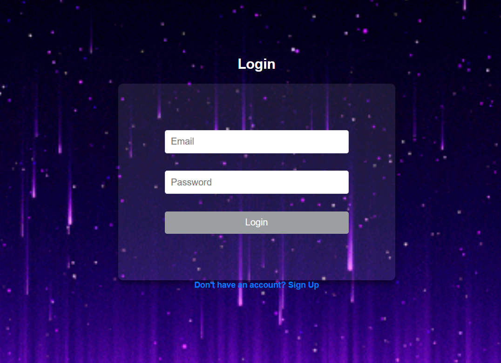
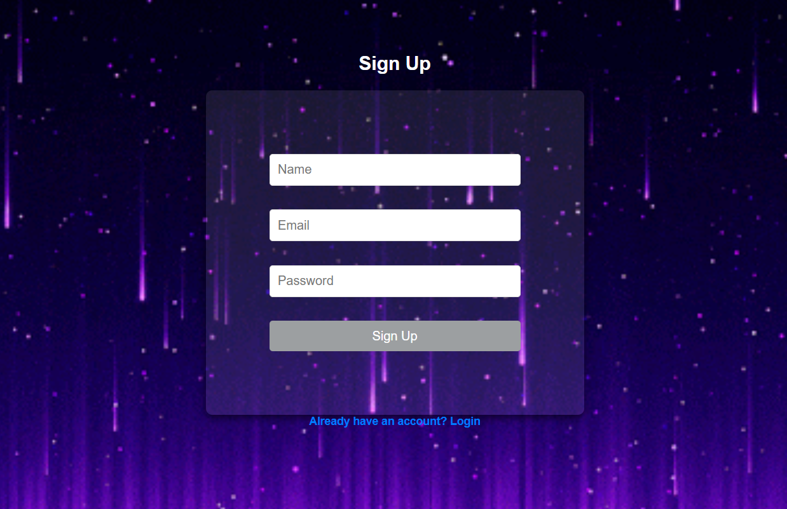
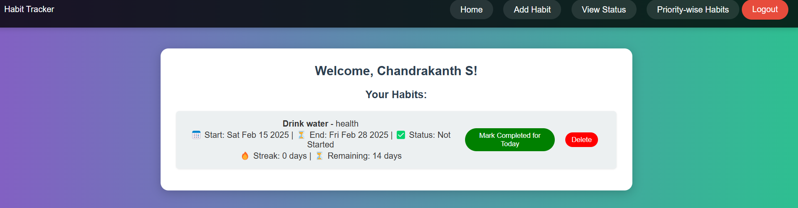
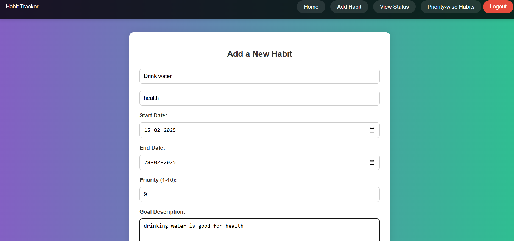
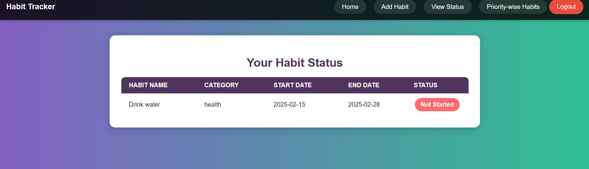
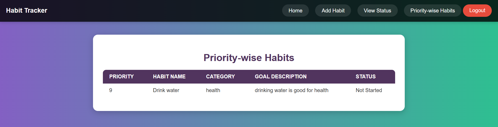

# Habit Tracker Web App 🏆  

A simple **habit tracking** web application built using **MongoDB, Express.js, and vanilla JavaScript**.

## 📌 Features  
- **Add new habits** with a name, category, priority, start & end dates, and goal description.  
- **Track progress** by marking habits as completed daily.  
- **Auto-update habit status** to `"In Progress"` if marked for at least one day.  
- **View all habits** sorted by priority.  
- **Delete habits** when no longer needed.  
- **Streak tracking** to keep users motivated.  

## 🛠️ Tech Stack  
- **Frontend:** HTML, CSS, JavaScript  
- **Backend:** Node.js, Express.js  
- **Database:** MongoDB (Atlas)  

---

# DEMO IMAGES
# Login 

# sign up

# DashBoard

# add habbit

# view status

# priority view

## 🚀 Installation & Setup  

### 1️⃣ Clone the Repository  
git clone https://github.com/chandrakanth0/SimpleHabitTracker.git
cd habit-tracker

# install dependency 
npm install

# create your .env
MONGO_URI=your_mongodb_connection_string
PORT=3000
JWT_SECRET=jwt_secret_123

# start the server
npm start

## 📡 API Endpoints  

### ✔ Add a Habit  
**`POST /api/habits/add`**  

{
  "userId": "user@example.com",
  "name": "Drink Water",
  "category": "Health",
  "startDate": "2025-02-14",
  "endDate": "2025-02-28",
  "priority": 10,
  "goalDescription": "Drink 8 glasses of water daily",
  "status": "Not Started"
}

# ✔ Get All Habits
GET /api/habits/all/:userId

# ✔ Get Habits by Priority
GET /api/habits/priority/:userId

# ✔ Mark Habit as Completed for Today
PUT /api/habits/mark-today/:id

# ✔ Delete a Habit
DELETE /api/habits/delete/:id

